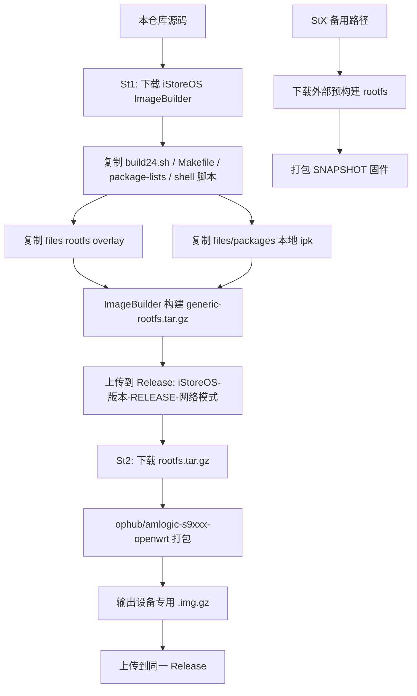

<div align="center">
  
  <h1>✨ iStoreOS-Actions：基于 ImageBuilder 与 ophub 工具链的 iStoreOS 固件构建仓库 ✨</h1>

  <p>
    
    
    
    
  </p>

  <p>
    <a href="#-项目介绍">项目介绍</a> ·
    <a href="#-快速开始">快速开始</a> ·
    <a href="#-如何使用固件">如何使用</a> ·
    <a href="#-添加或移除软件包">添加软件包</a> ·
    <a href="#-添加新功能">添加新功能</a> ·
    <a href="#-修改固件配置">修改固件配置</a> ·
    <a href="#-本地构建与调试">本地构建</a> ·
    <a href="#-常见问题">常见问题</a>
  </p>
</div>

---

## 📌 目录

- [🤔 项目介绍](#-项目介绍)
- [🧭 构建流程总览](#-构建流程总览)
- [📁 仓库结构说明](#-仓库结构说明)
- [🚀 快速开始](#-快速开始)
  - [1. Fork 仓库并启用 Actions](#1-fork-仓库并启用-actions)
  - [2. 检查 Actions 权限](#2-检查-actions-权限)
  - [3. 执行 St1：构建通用 rootfs](#3-执行-st1构建通用-rootfs)
  - [4. 执行 St2：打包设备固件](#4-执行-st2打包设备固件)
  - [5. 下载 Release 产物](#5-下载-release-产物)
- [🧰 如何使用固件](#-如何使用固件)
- [🌐 初始网络配置说明](#-初始网络配置说明)
- [🧩 第三方插件与默认集成](#-第三方插件与默认集成)
- [➕ 添加或移除软件包](#-添加或移除软件包)
  - [方式一：添加官方软件源里的包](#方式一添加官方软件源里的包)
  - [方式二：添加本地 ipk 包](#方式二添加本地-ipk-包)
  - [方式三：启用仓库外第三方插件](#方式三启用仓库外第三方插件)
  - [方式四：移除系统默认包](#方式四移除系统默认包)
  - [软件包排错思路](#软件包排错思路)
- [🛠️ 添加新功能](#️-添加新功能)
- [⚙️ 修改固件配置](#️-修改固件配置)
- [💿 添加或修改支持设备](#-添加或修改支持设备)
- [🔄 升级 iStoreOS / OpenWrt 版本](#-升级-istoreos--openwrt-版本)
- [🧪 本地构建与调试](#-本地构建与调试)
- [🧾 GitHub Actions 输入参数速查](#-github-actions-输入参数速查)
- [😊 支持设备](#-支持设备)
- [📷 项目截图](#-项目截图)
- [❓ 常见问题](#-常见问题)
- [🎉 Thanks](#-thanks)
- [🙏 免责声明](#-免责声明)

---

## 🤔 项目介绍

本仓库用于自动化构建面向 `armsr/armv8` 平台的 **iStoreOS / OpenWrt 固件**，重点支持 Amlogic、Rockchip、Allwinner 等电视盒子、开发板、小主机和软路由设备。

它不是传统应用源码仓库，而是一个 **固件装配仓库**：

1. 使用 iStoreOS ImageBuilder 生成通用 `rootfs.tar.gz`。
2. 使用 `ophub/amlogic-s9xxx-openwrt` 工具链把通用 rootfs 打包成指定设备可刷写的 `.img.gz`。
3. 通过 GitHub Actions 自动构建并上传到 GitHub Release。

> [!TIP]
> 本固件为 **非官方构建**，适合学习、研究、个人设备折腾与自用部署。不同设备的网卡顺序、启动介质、DTB、内核支持可能存在差异，请务必确认型号后再刷写。

### 当前默认信息

| 项目 | 当前值 |
|---|---|
| iStoreOS / OpenWrt 版本 | `24.10.6` |
| rootfs 目标平台 | `armsr/armv8` |
| rootfs profile | `generic` |
| 默认用户名 | `root` |
| 默认密码 | 空密码，首次登录后请立即设置 |
| 默认构建方式 | GitHub Actions 云构建 |
| Rootfs 构建 workflow | `.github/workflows/St1_Build-Rootfs-release.yml` |
| 设备固件打包 workflow | `.github/workflows/St2_Build-iStoreOS-ib.yml` |
| 备用 SNAPSHOT workflow | `.github/workflows/StX_Build-iStoreOS-src.yml` |

---

## 🧭 构建流程总览



### 三个 workflow 的定位

| Workflow | 作用 | 适用场景 | 是否使用本仓库自定义 rootfs |
|---|---|---|---|
| `St1_Build-Rootfs-release.yml` | 构建通用 rootfs | 需要集成本仓库包、配置、overlay 时必须先跑 | ✅ 是 |
| `St2_Build-iStoreOS-ib.yml` | 基于 St1 的 rootfs 打包设备固件 | 正常构建推荐路径 | ✅ 是 |
| `StX_Build-iStoreOS-src.yml` | 下载外部 rootfs 后打包 | St1 不可用或只想快速打包测试时 | ❌ 否 |

> [!IMPORTANT]
> 如果你修改了 `arm64/build24.sh`、`arm64/package-lists/**`、`shell/custom-packages.sh`、`files/packages/**`、`files/etc/**` 等内容，必须走 **St1 → St2**。备用的 **StX** 使用外部预构建 rootfs，不会包含你在本仓库中的 rootfs 自定义内容。

---

## 📁 仓库结构说明

```text
.
├── .github/
│   ├── build-config.env                # 构建版本单一来源
│   └── workflows/
│       ├── Check.yml                    # 轻量 CI：语法、校验清单、一致性检查
│       ├── _Pack-iStoreOS.yml           # St2/StX 共用打包 workflow
│       ├── St1_Build-Rootfs-release.yml # 构建通用 rootfs 并上传 Release
│       ├── St2_Build-iStoreOS-ib.yml    # 使用 St1 rootfs 打包指定设备 .img.gz
│       └── StX_Build-iStoreOS-src.yml   # 备用：下载外部 rootfs 后打包 SNAPSHOT
├── arm64/
│   ├── build24.sh                     # rootfs 主构建入口：加载包清单、整理第三方包、make image
│   ├── package-lists/                  # 官方包、本地默认包、可选包清单
│   ├── Makefile                       # ImageBuilder 内使用的 Makefile 变体
│   └── repositories.conf              # OpenWrt 远程软件源和本地 packages 源
├── config/
│   └── openwrt_boards.txt              # St2/StX 支持设备型号单一来源
├── scripts/
│   └── check_workflows.py              # workflow、版本、设备列表和包清单一致性检查
├── shell/
│   ├── custom-packages.sh             # 仓库外第三方插件开关、排除组件开关
│   └── prepare-packages.sh            # 整理 .run / .ipk 到 ImageBuilder packages/
├── files/                             # rootfs overlay，构建时映射到固件根目录 /
│   ├── etc/
│   │   ├── banner                     # 登录 banner，构建时替换“版本号”占位符
│   │   ├── rc.local                   # 系统启动完成后执行
│   │   └── uci-defaults/99-custom.sh  # 首次启动一次性初始化配置
│   ├── packages/                      # 本地 .ipk 包，构建时复制进 ImageBuilder packages/
│   └── screenshot/                    # README 图片资源
├── LICENSE
└── README.md
```

### 重要文件一句话说明

| 文件 | 你通常会在什么时候修改 |
|---|---|
| `arm64/build24.sh` | 修改 rootfs 构建流程、第三方仓库拉取方式、最终 make image 参数 |
| `arm64/package-lists/*.txt` | 增删默认内置软件包、启用 `files/packages` 下的本地插件 |
| `shell/custom-packages.sh` | 启用仓库外第三方插件，或用 `-包名` 排除默认组件 |
| `files/etc/uci-defaults/99-custom.sh` | 设置首次启动网络、主机名、语言、时区、防火墙、SSH/ttyd 等 |
| `files/etc/rc.local` | 系统每次启动完成后的简单命令 |
| `files/etc/banner` | 修改 SSH/TTY 登录欢迎信息 |
| `.github/build-config.env` | 修改 iStoreOS/OpenWrt 当前构建版本 |
| `.github/workflows/_Pack-iStoreOS.yml` | 修改 St2/StX 共用打包流程、打包 action 固定版本、Release 上传规则 |
| `.github/workflows/St1_Build-Rootfs-release.yml` | 修改 rootfs 构建版本、初始网络输入、Release 规则 |
| `.github/workflows/St2_Build-iStoreOS-ib.yml` | 修改 St1 rootfs 打包入口参数 |
| `.github/workflows/StX_Build-iStoreOS-src.yml` | 修改备用 SNAPSHOT 打包入口参数或外部 rootfs 来源 |
| `config/openwrt_boards.txt` | 添加、删除或校验 St2/StX 支持的 `openwrt_board` 值 |
| `arm64/repositories.conf` | 升级 OpenWrt 版本、切换远程包源、更新 kmods URL |

---

## 🚀 快速开始

### 1. Fork 仓库并启用 Actions

1. 点击 GitHub 页面右上角 **Fork**。
2. 进入你自己的 fork 仓库。
3. 打开 **Actions** 页面。
4. 如果 GitHub 提示需要启用 workflow，请点击启用。

> [!NOTE]
> St2 下载 rootfs 时使用 `${{ github.repository }}` 拼接当前仓库地址，Fork 后即使仓库重命名也无需手动修改下载 URL。

### 2. 检查 Actions 权限

本仓库发布 Release 默认使用 GitHub Actions 内置的 `GITHUB_TOKEN`，workflow 已声明 `permissions: contents: write`，通常不需要额外配置个人 PAT。

请在你的 fork 仓库检查：

1. 打开 **Settings → Actions → General**。
2. 在 **Workflow permissions** 中允许 Actions 读取和写入仓库内容。
3. 如果组织或仓库策略禁止写入，请放开 Release 发布所需权限后再运行 St1/St2。

> [!CAUTION]
> 不要把个人 token 写进 README、workflow、脚本或任何可见代码中。泄露 token 可能导致仓库被恶意发布、删除或篡改。

### 3. 执行 St1：构建通用 rootfs

在 GitHub 网页执行：

1. 进入 **Actions**。
2. 选择 **💿 St1_Build-Rootfs-release**。
3. 点击 **Run workflow**。
4. 按需填写参数。

| 参数 | 示例 | 说明 |
|---|---|---|
| `build_version` | `20260417` | 要下载的 iStoreOS ImageBuilder 版本 |
| `network_settings` | `dhcp` 或 `static` | 首次启动网络模式 |
| `ipaddr` | `192.168.5.88` | 选择 `static` 时写入 LAN IP |
| `gateway` | `192.168.5.1` | 选择 `static` 时写入默认网关 |

构建成功后会上传：

```text
istoreos-armsr-armv8-generic-rootfs.tar.gz
```

Release tag 规则：

```text
iStoreOS-24.10.6-RELEASE-dhcp
iStoreOS-24.10.6-RELEASE-static
```

### 4. 执行 St2：打包设备固件

St1 成功后再执行 St2：

1. 进入 **Actions**。
2. 选择 **💿 St2_Build-iStoreOS-ib**。
3. 点击 **Run workflow**。
4. 输入设备型号、选择内核版本、rootfs 类型和网络模式。

| 参数 | 推荐值 | 说明 |
|---|---|---|
| `openwrt_board` | `s905d_s905x3_s912_s922x-ct2000` | 设备板型，必须是 `config/openwrt_boards.txt` 中的一行 |
| `openwrt_kernel` | `6.6.y` | 内核系列，可选 `6.6.y`、`6.12.y`、`6.18.y` |
| `auto_kernel` | `true` | 自动使用可用的最新稳定内核，通常保持默认 |
| `openwrt_rootfs` | `RELEASE` | 当前只提供 `RELEASE` |
| `network_settings` | 与 St1 保持一致 | St2 会按这个值下载对应 Release 下的 rootfs |

构建成功后会上传设备固件：

```text
istoreos_24.10.6_*.img.gz
```

> [!IMPORTANT]
> St2 的 `network_settings` 必须与 St1 产出的 Release 匹配。例如 St1 跑的是 `dhcp`，St2 也要选 `dhcp`，否则会下载不到 rootfs。

### 5. 下载 Release 产物

进入仓库 **Releases** 页面，找到对应 tag：

```text
iStoreOS-24.10.6-RELEASE-dhcp
# 或
iStoreOS-24.10.6-RELEASE-static
```

通常你会看到两类文件：

| 文件 | 用途 |
|---|---|
| `*generic-rootfs.tar.gz` | 通用 rootfs，供后续打包或二次处理 |
| `*.img.gz` | 指定设备可刷写固件 |

---

## 🧰 如何使用固件

### 刷写前准备

1. 确认设备型号和 `openwrt_board` 完全匹配。
2. 确认启动方式：TF 卡、U 盘、eMMC、NVMe、SATA 等，不同设备差异较大。
3. 备份原系统、引导分区、重要配置和数据。
4. 下载对应设备的 `.img.gz`。
5. 解压或直接使用支持 `.gz` 的写盘工具写入。

常见写盘工具：

- Windows / macOS / Linux：balenaEtcher、Rufus、USBImager
- Linux 命令行：`gzip` + `dd`
- Amlogic 设备：可结合设备已有刷机方式、U 盘启动、晶晨宝盒等工具使用

### Linux 命令行写盘示例

> [!CAUTION]
> `dd` 写错磁盘会清空数据。请先用 `lsblk` 确认目标盘，下面的 `/dev/sdX` 必须替换为你的真实设备。

```bash
gzip -dc istoreos_24.10.6_xxx.img.gz | sudo dd of=/dev/sdX bs=4M conv=fsync status=progress
sync
```

### 首次启动与登录

| 项目 | 说明 |
|---|---|
| Web 管理界面 | 浏览器访问设备 IP |
| SSH 用户名 | `root` |
| SSH 默认密码 | 空密码 |
| 建议操作 | 首次登录后立即设置 root 密码 |

### 刷入 eMMC / 更换内核

本仓库集成 `luci-app-amlogic` 时，可在 iStoreOS 中使用晶晨宝盒相关功能。常见入口：

```text
登录 iStoreOS → 系统 → 晶晨宝盒 / Amlogic Service
```

可用于安装到 eMMC、替换内核等。不同设备风险不同，请确认设备型号、DTB、内核支持和启动方式。

---

## 🌐 初始网络配置说明

网络初始化逻辑主要在：

```text
files/etc/uci-defaults/99-custom.sh
```

St1 会把 `network_settings`、`ipaddr`、`gateway` 写入 `99-custom.sh` 顶部变量。脚本首次启动时根据模式执行对应分支，不再依赖 workflow 按固定行号删除代码块：

- 选择 `static`：使用构建参数写入静态 LAN IP、网关和 DNS。
- 选择 `dhcp`：启动时自动检测物理网口并配置单网口或多网口布局。

### static 模式

默认配置：

| 项目 | 默认值 |
|---|---|
| LAN IP | `192.168.5.88` |
| 子网掩码 | `255.255.255.0` |
| 网关 | `192.168.5.1` |
| DNS | `223.5.5.5` |

执行 St1 时可以通过输入参数覆盖：

```text
ipaddr=你的管理 IP
gateway=你的网关 IP
```

### dhcp 模式

DHCP 模式会在首次启动时检测物理网口：

| 设备类型 | 行为 |
|---|---|
| 单网口设备 | LAN 使用 DHCP，从上级路由获取地址 |
| 多网口设备 | 第一个物理网口作为 WAN DHCP，其余物理网口加入 LAN，LAN IP 为 `192.168.100.1` |
| 特殊设备 | `radxa,e20c`、`friendlyarm,nanopi-r5c` 会使用脚本内置的 WAN/LAN 映射 |

如果你不知道设备 IP：

1. 登录上级路由器查看 DHCP 客户端列表。
2. 查找主机名 `iStoreOS`。
3. 多网口设备可尝试连接 LAN 口并访问 `http://192.168.100.1`。

---

## 🧩 第三方插件与默认集成

### 本地 `files/packages` 中已有插件

| 插件 | 包名示例 | 当前状态 | 说明 |
|---|---|---|---|
| 晶晨宝盒 | `luci-app-amlogic`、`luci-i18n-amlogic-zh-cn` | ✅ 默认集成 | 用于 Amlogic 相关安装、内核替换等 |
| 内存释放 | `luci-app-ramfree`、`luci-i18n-ramfree-zh-cn` | ✅ 默认集成 | LuCI 内存释放工具 |
| Lucky | `lucky`、`luci-app-lucky` | 📦 本地可选 | 已放入本地 ipk，默认未启用 |
| AdGuardHome | `luci-app-adguardhome` | 📦 本地可选 | 已放入本地 ipk，默认未启用 |
| OpenList2 | `openlist2`、`luci-app-openlist2` | 📦 本地可选 | 已放入本地 ipk，默认未启用 |
| FileBrowser Go | `filebrowser`、`luci-app-filebrowser-go` | 📦 本地可选 | 已放入本地 ipk，默认未启用 |
| 其他依赖 | `perlbase-*` 等 | 按需使用 | 供部分插件依赖 |

对应开关位于 `arm64/package-lists/`：

```text
arm64/package-lists/local-default.txt   # 当前默认集成的本地包
arm64/package-lists/local-optional.txt  # 已放入仓库但默认不安装的示例
```

当前默认集成：

```text
luci-app-amlogic
luci-i18n-amlogic-zh-cn
luci-app-ramfree
luci-i18n-ramfree-zh-cn
```

### 状态标记

| 标记 | 含义 |
|---|---|
| ✅ 默认集成 | 当前构建默认安装进固件 |
| 📦 本地可选 | `.ipk` 已在仓库中，但需要把包名加入 `arm64/package-lists/local-default.txt` 或 `CUSTOM_PACKAGES` 才会安装 |
| 🌐 仓库外可选 | 由 `shell/custom-packages.sh` 从外部插件仓库拉取 |
| ⭕ 不支持 | 暂未适配或不建议集成 |

---

## ➕ 添加或移除软件包

OpenWrt ImageBuilder 使用 `PACKAGES` 变量控制内置包：

```bash
PACKAGES="$PACKAGES 包名1 包名2 -要排除的包名"
```

规则很简单：

- `包名`：安装该包。
- `-包名`：从默认集合中排除该包。
- LuCI 插件通常至少需要：主程序包 + `luci-app-*` + 中文语言包 `luci-i18n-*-zh-cn`。
- 仅把 `.ipk` 放入 `files/packages` **不会自动安装**，还需要把包名加入 `PACKAGES`。

### 方式一：添加官方软件源里的包

适合软件包已经存在于 OpenWrt / iStoreOS 远程源的情况。

#### 操作步骤

1. 打开官方包清单：

```text
arm64/package-lists/official.txt
```

2. 每行添加一个包名，例如：

```text
htop
tcpdump
```

3. 如果是 LuCI 插件，通常添加：

```text
luci-app-example
luci-i18n-example-zh-cn
```

4. 提交后执行 St1 → St2。

#### 示例：添加 WireGuard LuCI 管理界面

`build24.sh` 已经包含 `wireguard-tools` 和 `luci-proto-wireguard`，如果你还想加额外界面或依赖，可按需追加：

```text
luci-app-wireguard
luci-i18n-wireguard-zh-cn
```

> [!NOTE]
> 包名是否存在取决于当前 `repositories.conf` 指向的软件源。不同 OpenWrt 版本之间包名可能变化。

### 方式二：添加本地 ipk 包

适合你已经有编译好的 `.ipk` 文件，或者插件不在官方源中。

#### 目录建议

```text
files/packages/插件名/
├── 主程序_版本_aarch64_generic.ipk
├── luci-app-插件名_版本_all.ipk
└── luci-i18n-插件名-zh-cn_版本_all.ipk
```

例如：

```text
files/packages/luci-app-example/
├── example_1.0.0-r1_aarch64_generic.ipk
├── luci-app-example_1.0.0-r1_all.ipk
└── luci-i18n-example-zh-cn_1.0.0-r1_all.ipk
```

#### 操作步骤

1. 把 `.ipk` 放到 `files/packages/<插件名>/`。
2. 打开 `arm64/package-lists/local-default.txt`。
3. 每行追加一个要安装的包名：

```text
example
luci-app-example
luci-i18n-example-zh-cn
```

4. 重新生成本地包校验清单：

```bash
shopt -s globstar nullglob
sha256sum files/packages/**/*.ipk > files/packages/SHA256SUMS
```

5. 执行 St1 → St2。

#### 为什么放入 ipk 后还要加 PACKAGES？

St1 workflow 会执行：

```bash
find files/packages/ -name "*.ipk" -exec cp {} imagebuilder/packages/ \;
```

这只表示把 `.ipk` 加入 ImageBuilder 的本地软件源。真正安装哪些包仍由 `package-lists/*.txt` 与 `CUSTOM_PACKAGES` 组合后的 `PACKAGES` 决定。

#### 本地 ipk 兼容性检查

请尽量确保：

- 架构匹配：`aarch64_generic` 或 `all`。
- OpenWrt 版本匹配：当前为 `24.10.6`。
- 依赖完整：缺依赖会导致 ImageBuilder 安装失败。
- 校验清单同步：新增、删除或替换 `.ipk` 后同步更新 `files/packages/SHA256SUMS`。
- 内核模块匹配：`kmod-*` 对内核 ABI 很敏感，不建议随意混用不同版本。

### 方式三：启用仓库外第三方插件

仓库外第三方插件开关在：

```text
shell/custom-packages.sh
```

当前包含一些注释示例：

```bash
# 分区扩容
#CUSTOM_PACKAGES="$CUSTOM_PACKAGES luci-app-partexp"
#CUSTOM_PACKAGES="$CUSTOM_PACKAGES luci-i18n-partexp-zh-cn"

# 网络测速
#CUSTOM_PACKAGES="$CUSTOM_PACKAGES luci-app-netspeedtest"
#CUSTOM_PACKAGES="$CUSTOM_PACKAGES luci-i18n-netspeedtest-zh-cn"
```

启用方式：去掉前面的 `#`。

例如启用网络测速：

```bash
CUSTOM_PACKAGES="$CUSTOM_PACKAGES luci-app-netspeedtest"
CUSTOM_PACKAGES="$CUSTOM_PACKAGES luci-i18n-netspeedtest-zh-cn"
```

当 `CUSTOM_PACKAGES` 非空时，`build24.sh` 会：

1. 按 `STORE_REPO_URL` 和 `STORE_REPO_REF` 拉取第三方插件仓库，默认固定到当前验证过的 `wukongdaily/store` commit。
2. 复制 `run/arm64` 下的 `.run` / `.ipk` 到 `extra-packages/`。
3. 执行 `shell/prepare-packages.sh` 解包并整理 `.ipk`。
4. 把 `CUSTOM_PACKAGES` 追加到最终 `PACKAGES`。

如需临时跟随第三方仓库最新分支，可以在构建环境中覆盖：

```bash
STORE_REPO_REF=master
```

> [!CAUTION]
> 仓库外插件来自外部仓库，可能变更、下架或引入新依赖。默认固定 commit 是为了提升可复现性；如果主动切到最新分支，构建失败时优先检查外部插件源变化。

### 方式四：移除系统默认包

使用 `-包名` 可以从默认包集合中排除组件。

示例：移除 iStore 商店：

```bash
CUSTOM_PACKAGES="$CUSTOM_PACKAGES -luci-app-store"
```

示例：移除首页和网络向导相关语言包：

```bash
CUSTOM_PACKAGES="$CUSTOM_PACKAGES -luci-i18n-quickstart-zh-cn"
```

如果包是在 `package-lists/*.txt` 中添加的，也可以直接从对应清单中移除或注释掉。

> [!WARNING]
> 不建议随意移除 `base-files`、`busybox`、`netifd`、`uci`、`ubus`、`firewall4`、`dnsmasq-full`、`opkg`、`kernel` 等基础组件，否则固件可能无法启动或无法联网。

### 软件包排错思路

在 ImageBuilder 目录内可使用：

```bash
# 查看 profile 信息
make info

# 预览最终会安装哪些包
make manifest PROFILE=generic PACKAGES="<你的包列表>" STRIP_ABI=1

# 查看某个包依赖哪些包
make package_depends PACKAGE=<package-name>

# 查看哪些包依赖某个包
make package_whatdepends PACKAGE=<package-name>
```

常见错误：

| 报错/现象 | 可能原因 | 处理方式 |
|---|---|---|
| `Unknown package` | 包名不存在或软件源不包含 | 检查包名、版本、`repositories.conf` |
| `Cannot satisfy dependencies` | 依赖缺失 | 补齐依赖 ipk 或更换兼容版本 |
| `kernel version mismatch` | `kmod-*` 与内核 ABI 不匹配 | 使用当前版本官方 kmods，或更新 `repositories.conf` |
| LuCI 菜单不显示 | 只装了主程序，没装 `luci-app-*` | 补充 LuCI 包和语言包 |
| 中文缺失 | 没装 `luci-i18n-*-zh-cn` | 补充中文语言包 |

---

## 🛠️ 添加新功能

在 OpenWrt / iStoreOS 中，“功能”通常由三部分组成：

1. 软件包：通过 `PACKAGES` 安装。
2. 文件：通过 `files/` overlay 放入固件。
3. 初始化配置：通过 `uci-defaults`、`rc.local` 或 init 脚本启用。

### 1. 使用 files overlay 添加文件

`files/` 会映射到固件根目录 `/`。

例如：

| 仓库路径 | 固件内路径 |
|---|---|
| `files/etc/config/example` | `/etc/config/example` |
| `files/usr/bin/example.sh` | `/usr/bin/example.sh` |
| `files/etc/init.d/example` | `/etc/init.d/example` |
| `files/etc/uci-defaults/99-example.sh` | `/etc/uci-defaults/99-example.sh` |

### 2. 添加首次启动功能

适合设置默认配置、写入 UCI、启用服务等。

新增文件：

```text
files/etc/uci-defaults/99-example.sh
```

示例：

```sh
#!/bin/sh

# 设置一个示例 UCI 配置
uci set system.@system[0].hostname='iStoreOS'
uci commit system

# 启用某个服务
/etc/init.d/example enable 2>/dev/null || true

exit 0
```

`uci-defaults` 脚本特点：

- 只在首次启动时执行。
- 返回 `exit 0` 后会被系统删除。
- 适合一次性初始化，不适合长期驻留任务。

### 3. 添加每次启动都执行的命令

简单命令可以放入：

```text
files/etc/rc.local
```

当前仓库已用于：

```sh
if mount | grep ' on / ' | grep -q '[(,]ro[,)]'; then
    mount -o remount,rw /
fi
```

用于缓解部分设备通过晶晨宝盒写入 eMMC 后根分区只读的问题；只有检测到根分区为只读时才会重新挂载。

> [!NOTE]
> `rc.local` 适合非常简单的启动后命令。如果是长期运行的服务，建议写 `/etc/init.d/<service>`，并在 `uci-defaults` 中 enable。

### 4. 添加自定义 init.d 服务

示例路径：

```text
files/etc/init.d/myfeature
files/usr/bin/myfeature.sh
```

`files/etc/init.d/myfeature` 示例：

```sh
#!/bin/sh /etc/rc.common

START=99
USE_PROCD=1

start_service() {
    procd_open_instance
    procd_set_param command /usr/bin/myfeature.sh
    procd_set_param respawn
    procd_close_instance
}
```

`files/usr/bin/myfeature.sh` 示例：

```sh
#!/bin/sh
while true; do
    logger -t myfeature "running"
    sleep 300
done
```

首次启动启用服务：

```sh
/etc/init.d/myfeature enable
```

> [!IMPORTANT]
> 通过 overlay 添加脚本时要确保可执行权限。Git 中应保留执行位；如果不确定，可在 workflow 中 `chmod +x`，或在首次启动脚本中执行 `chmod +x /usr/bin/myfeature.sh /etc/init.d/myfeature`。

### 5. 添加默认防火墙规则

在 `files/etc/uci-defaults/99-custom.sh` 中添加：

```sh
uci add firewall rule
uci set firewall.@rule[-1].name='Allow-Example'
uci set firewall.@rule[-1].src='wan'
uci set firewall.@rule[-1].proto='tcp'
uci set firewall.@rule[-1].dest_port='12345'
uci set firewall.@rule[-1].target='ACCEPT'
uci commit firewall
```

> [!CAUTION]
> 不要随意开放 WAN 入站端口。暴露管理面、SSH、ttyd、NAS 服务到公网会带来安全风险。

### 6. 添加默认计划任务

可在 `uci-defaults` 中写入 `/etc/crontabs/root`：

```sh
cat <<'EOF' >> /etc/crontabs/root
# 每天 03:30 执行示例任务
30 3 * * * /usr/bin/example.sh
EOF
/etc/init.d/cron enable
/etc/init.d/cron restart
```

### 7. 添加默认配置文件

如果某个应用读取 `/etc/config/<name>`，可以直接放入：

```text
files/etc/config/<name>
```

也可以在 `uci-defaults` 中使用 `uci set` 动态生成。两者区别：

| 方式 | 优点 | 适用场景 |
|---|---|---|
| 直接放配置文件 | 直观、完整、便于复制 | 配置稳定且不依赖构建参数 |
| `uci-defaults` 写配置 | 可根据网口、设备、输入参数动态调整 | 网络、主机名、服务启用等初始化逻辑 |

---

## ⚙️ 修改固件配置

### 修改主机名、时区、语言

位置：

```text
files/etc/uci-defaults/99-custom.sh
```

当前默认：

```sh
uci set system.@system[0].hostname='iStoreOS'
uci set system.@system[0].timezone='CST-8'
uci set system.@system[0].zonename='Asia/Shanghai'
uci set luci.main.lang='zh_cn'
uci commit system
uci commit luci
```

### 修改默认静态 IP

需要同步修改两个地方：

1. `files/etc/uci-defaults/99-custom.sh` 中 static 块默认值。
2. `.github/workflows/St1_Build-Rootfs-release.yml` 中 `ipaddr`、`gateway` 的默认输入值。

例如改为：

```sh
uci set network.lan.ipaddr='192.168.10.2'
uci set network.lan.gateway='192.168.10.1'
uci set network.lan.dns='223.5.5.5'
```

workflow 默认输入也改为：

```yaml
ipaddr:
  default: '192.168.10.2'
gateway:
  default: '192.168.10.1'
```

### 修改 DHCP 模式多网口默认 LAN IP

位置：

```text
files/etc/uci-defaults/99-custom.sh
```

当前默认：

```sh
uci set network.lan.ipaddr='192.168.100.1'
uci set network.lan.netmask='255.255.255.0'
```

改成你需要的网段即可。

### 修改特殊设备 WAN/LAN 映射

当前脚本对部分设备特殊处理：

```sh
case "$board_name" in
    "radxa,e20c"|"friendlyarm,nanopi-r5c")
        wan_ifname="eth1"
        lan_ifnames="eth0"
        ;;
    *)
        wan_ifname=$(echo "$ifnames" | awk '{print $1}')
        lan_ifnames=$(echo "$ifnames" | cut -d ' ' -f2-)
        ;;
esac
```

如果你的设备网口顺序相反，可新增分支：

```sh
"your,vendor-board")
    wan_ifname="eth1"
    lan_ifnames="eth0 eth2"
    ;;
```

获取设备 `board_name` 的常用方式：

```sh
cat /tmp/sysinfo/board_name
```

### 修改默认防火墙策略

当前为了方便虚拟机或首次访问 WebUI，脚本设置：

```sh
uci set firewall.@zone[1].input='ACCEPT'
```

如果你希望更严格，可以改回：

```sh
uci set firewall.@zone[1].input='REJECT'
```

请注意这可能影响首次访问和调试。

### 修改 SSH / ttyd 访问范围

当前脚本设置：

```sh
# 设置所有网口可访问 ttyd
uci delete ttyd.@ttyd[0].interface

# 设置所有网口可连接 SSH
uci set dropbear.@dropbear[0].Interface=''
uci commit
```

如果你只希望 LAN 可访问，请按 OpenWrt 配置方式限制对应 interface。

### 修改登录 banner

位置：

```text
files/etc/banner
```

其中 `版本号` 会在 St1 中替换为 `.github/build-config.env` 的 `VERSION`，例如 `24.10.6`。

### 修改 rootfs overlay

任何放入 `files/` 的文件都会覆盖或新增到固件根目录。例如：

```text
files/etc/motd           -> /etc/motd
files/root/readme.txt    -> /root/readme.txt
files/usr/bin/tool.sh    -> /usr/bin/tool.sh
```

> [!CAUTION]
> overlay 会覆盖固件内同路径文件。修改系统关键文件前请确认路径和内容，否则可能导致无法启动或服务异常。

---

## 💿 添加或修改支持设备

设备列表统一维护在：

```text
config/openwrt_boards.txt
```

St2 和 StX 的 `openwrt_board` 输入改为字符串，并在共用打包 workflow `_Pack-iStoreOS.yml` 中校验该值必须存在于 `config/openwrt_boards.txt`。这样新增设备只需要维护一个列表，避免两个 workflow 的下拉选项不同步。

### 新增一个 ophub 已支持的设备

1. 确认上游 `ophub/amlogic-s9xxx-openwrt` 已支持该 `openwrt_board` 值。
2. 在 `config/openwrt_boards.txt` 中新增一行。
3. 更新 README 的 [支持设备](#-支持设备) 表。
4. 如果该设备网口顺序特殊，更新 `files/etc/uci-defaults/99-custom.sh` 的网口映射逻辑。
5. 运行 `python scripts/check_workflows.py` 确认设备列表无重复且 workflow 仍调用共用打包流程。

### 新增一个上游不支持的设备

需要先解决：

- 设备 DTB / DTS。
- 启动方式。
- 内核支持。
- 网卡、USB、存储、无线等驱动。
- ophub 打包脚本中的 board 配置。

建议优先向上游适配，或 fork 打包 action 后在本仓库 workflow 中切换为你的 fork。

### 修改默认设备

St2 / StX 当前默认设备：

```yaml
default: "s905d_s905x3_s912_s922x-ct2000"
```

如果你经常构建某个设备，可以修改 St2/StX 中 `openwrt_board.default`，但默认值必须存在于 `config/openwrt_boards.txt`。

---

## 🔄 升级 iStoreOS / OpenWrt 版本

升级版本时不要只改一个地方，需要同步检查以下位置。

### 必查文件

| 文件 | 需要检查的内容 |
|---|---|
| `.github/build-config.env` | `VERSION`，影响 Release tag、下载 URL、文件名 |
| `.github/workflows/St1_Build-Rootfs-release.yml` | `build_version.options`、ImageBuilder 下载地址 |
| `.github/workflows/St2_Build-iStoreOS-ib.yml` | 确保 St2 下载 tag 与 St1 上传 tag 匹配 |
| `.github/workflows/StX_Build-iStoreOS-src.yml` | SNAPSHOT Release 名称和外部 rootfs 来源 |
| `arm64/repositories.conf` | OpenWrt release 路径、`kmods` 路径、架构源 |
| `arm64/package-lists/*.txt` | 包名是否仍存在、是否有改名或依赖变化 |
| `files/packages/**` | 本地 `.ipk` 是否兼容新版本 |

### repositories.conf 示例

当前：

```text
src/gz openwrt_core https://downloads.openwrt.org/releases/24.10.6/targets/armsr/armv8/packages
src/gz openwrt_base https://downloads.openwrt.org/releases/24.10.6/packages/aarch64_generic/base
src/gz openwrt_kmods https://downloads.openwrt.org/releases/24.10.6/targets/armsr/armv8/kmods/6.6.127-1-2a67cc4ae7b7c1f0c3b665bec0c6f387
```

升级时尤其注意 `openwrt_kmods`：

- kmods 路径包含内核 ABI。
- 内核 ABI 不匹配会导致 `kmod-*` 安装失败。
- 最好从对应版本的官方 ImageBuilder 或 OpenWrt 下载目录中确认。

### 推荐升级流程

1. 新增或修改 St1 `build_version`。
2. 修改 `.github/build-config.env` 中的 `VERSION`。
3. 更新 `arm64/repositories.conf`。
4. 暂时减少自定义插件，先构建最小可用 rootfs。
5. 逐个恢复本地 ipk 和第三方插件。
6. 使用目标设备测试启动、网络、WebUI、SSH、插件页面。
7. 更新 README 中的版本信息和已验证设备。

---

## 🧪 本地构建与调试

### 本地语法检查

修改 shell 脚本后建议至少运行：

```bash
bash -n arm64/build24.sh shell/*.sh
sh -n files/etc/uci-defaults/99-custom.sh files/etc/rc.local
python scripts/check_workflows.py
sha256sum -c files/packages/SHA256SUMS

git diff --check
```

说明：

- `bash -n` / `sh -n` 只检查语法，不执行脚本。
- `scripts/check_workflows.py` 检查 workflow 固定 action、版本配置、设备列表、包清单等一致性。
- `sha256sum -c` 校验本地 `.ipk` 是否与 `files/packages/SHA256SUMS` 一致。
- `git diff --check` 检查补丁中的空白错误。

### 本地复现 rootfs 构建

> [!IMPORTANT]
> `arm64/Makefile` 不能直接在仓库根目录运行。它依赖 ImageBuilder 内部的 `rules.mk`、`include/`、`scripts/`、`.config` 等文件。请先下载并展开 iStoreOS ImageBuilder。

推荐在 Ubuntu / Debian / WSL2 中执行：

```bash
sudo apt-get update
sudo apt-get install -y build-essential libncurses5-dev zstd curl unzip tree

curl --fail --location --show-error --retry 3 --retry-delay 5 \
  -o imagebuilder.tar.zst \
  https://github.com/Kwonelee/iStoreOS-Actions/releases/download/iStoreOS-ImageBuilder/20260417-istoreos-imagebuilder-armsr-armv8.Linux-x86_64.tar.zst
sha256sum imagebuilder.tar.zst

tar --use-compress-program=unzstd -xvf imagebuilder.tar.zst
mv istoreos-imagebuilder-* imagebuilder

cp arm64/{build24.sh,Makefile,repositories.conf} imagebuilder/
cp -r arm64/package-lists imagebuilder/
cp shell/{prepare-packages.sh,custom-packages.sh} imagebuilder/
find files/packages/ -name "*.ipk" -exec cp {} imagebuilder/packages/ \;

mkdir -p imagebuilder/files/etc/{uci-defaults,banner1}
cp files/etc/uci-defaults/99-custom.sh imagebuilder/files/etc/uci-defaults/
cp files/etc/banner imagebuilder/files/etc/banner1/
cp files/etc/rc.local imagebuilder/files/etc/
sed -i 's/版本号/24.10.6/g' imagebuilder/files/etc/uci-defaults/99-custom.sh imagebuilder/files/etc/banner1/banner
sed -i 's/__NETWORK_SETTINGS__/dhcp/g' imagebuilder/files/etc/uci-defaults/99-custom.sh
sed -i 's/__STATIC_IPADDR__/192.168.5.88/g' imagebuilder/files/etc/uci-defaults/99-custom.sh
sed -i 's/__STATIC_GATEWAY__/192.168.5.1/g' imagebuilder/files/etc/uci-defaults/99-custom.sh

cd imagebuilder
sed -i 's/# CONFIG_TARGET_ROOTFS_TARGZ is not set/CONFIG_TARGET_ROOTFS_TARGZ=y/' .config
sed -i 's|CONFIG_TARGET_ROOTFS_SQUASHFS=.*|# CONFIG_TARGET_ROOTFS_SQUASHFS is not set|g' .config
sed -i 's|CONFIG_TARGET_IMAGES_GZIP=.*|# CONFIG_TARGET_IMAGES_GZIP is not set|g' .config

bash ./build24.sh
```

构建成功后产物通常位于：

```text
imagebuilder/bin/targets/armsr/armv8/
```

### ImageBuilder 常用调试命令

在 `imagebuilder/` 目录内：

```bash
# 查看可用 profile
make info

# 查看最终安装清单
make manifest PROFILE=generic PACKAGES="<packages>" STRIP_ABI=1

# 查看包依赖
make package_depends PACKAGE=<package-name>

# 查看反向依赖
make package_whatdepends PACKAGE=<package-name>

# 清理构建产物
make clean
```

### 使用 GitHub CLI 触发构建

如果你安装了 `gh` 并已登录，可以命令行触发。

#### St1：构建 rootfs

```bash
gh workflow run St1_Build-Rootfs-release.yml \
  -f build_version=20260417 \
  -f network_settings=dhcp \
  -f ipaddr=192.168.5.88 \
  -f gateway=192.168.5.1
```

#### St2：打包设备固件

```bash
gh workflow run St2_Build-iStoreOS-ib.yml \
  -f openwrt_board=s905d_s905x3_s912_s922x-ct2000 \
  -f openwrt_kernel=6.6.y \
  -F auto_kernel=true \
  -f openwrt_rootfs=RELEASE \
  -f network_settings=dhcp
```

#### StX：备用 SNAPSHOT 打包

```bash
gh workflow run StX_Build-iStoreOS-src.yml \
  -f openwrt_board=s905d_s905x3_s912_s922x-ct2000 \
  -f openwrt_kernel=6.6.y \
  -F auto_kernel=true
```

---

## 🧾 GitHub Actions 输入参数速查

### St1_Build-Rootfs-release

| 参数 | 类型 | 默认值 | 可选值/说明 |
|---|---|---|---|
| `build_version` | choice | `20260417` | `20260417`、`20260410`、`20260320`、`20251231` |
| `network_settings` | choice | `dhcp` | `dhcp` 或 `static` |
| `ipaddr` | string | `192.168.5.88` | static 模式管理 IP |
| `gateway` | string | `192.168.5.1` | static 模式默认网关 |

### St2_Build-iStoreOS-ib

| 参数 | 类型 | 默认值 | 说明 |
|---|---|---|---|
| `openwrt_board` | string | `s905d_s905x3_s912_s922x-ct2000` | 设备型号，必须存在于 `config/openwrt_boards.txt` |
| `openwrt_kernel` | choice | `6.6.y` | `6.6.y`、`6.12.y`、`6.18.y` |
| `auto_kernel` | boolean | `true` | 自动选择最新可用内核 |
| `openwrt_rootfs` | choice | `RELEASE` | 当前仅 `RELEASE` |
| `network_settings` | choice | `dhcp` | 必须与 St1 rootfs 的网络模式一致 |

### StX_Build-iStoreOS-src

| 参数 | 类型 | 默认值 | 说明 |
|---|---|---|---|
| `openwrt_board` | string | `s905d_s905x3_s912_s922x-ct2000` | 设备型号，必须存在于 `config/openwrt_boards.txt` |
| `openwrt_kernel` | choice | `6.6.y` | `6.6.y`、`6.12.y`、`6.18.y` |
| `auto_kernel` | boolean | `true` | 自动选择最新可用内核 |

---

## 😊 支持设备

> [!NOTE]
> 下表用于快速查找设备类别。实际构建时请以 `config/openwrt_boards.txt` 中的 `openwrt_board` 值为准，并确认你的设备具体型号、内存、网卡、启动方式和 DTB 是否匹配。

| 芯片 | 设备 |
|---|---|
| a311d | Khadas-VIM3, WXY-OES |
| s922x | Beelink-GT-King, Beelink-GT-King-Pro, Ugoos-AM6-Plus, ODROID-N2, X88-King, Ali-CT2000, WXY-OES-Plus |
| s905x3 | X96-Max+, HK1-Box, Vontar-X3, H96-Max-X3, Ugoos-X3, TX3(QZ), TX3(BZ), X96-Air, X96-Max+_A100, A95X-F3-Air, Tencent-Aurora-3Pro(s905x3-b), X96-Max+Q1, X96-Max+100W, X96-Max+_2101, Infinity-B32, Whale, X88-Pro-X3, X99-Max-Plus, Transpeed-X3-Plus, TOX1, Khadas-VIM3L |
| s905x2 | X96Max-4G, X96Max-2G, MECOOL-KM3-4G, Tanix-Tx5-Max, A95X-F2, HG680-FJ |
| s905l3a | E900V22C/D, CM311-1a-YST, M401A, M411A, UNT403A, UNT413A, ZTE-B863AV3.2-M, CM311-1a-CH, IP112H, B863AV3.1-M2 |
| s905l3b | CM201-1, CM211-1, CM311-1, E900V21D, E900V22D, E900V21E, E900V22E, M302A/M304A, Hisense-IP103H, TY1608, MGV2000, B860AV-2.1M, UNT403A, RG020ET-CA, M411A |
| s905l3 | CM211-1, CM311-1, HG680-LC, M401A, UNT400G1, UNT400G, UNT402A, ZXV10-BV310, M411A, ZXV10-B860AV3.2-M, ZXV10-B860AV2.1-U, E900V22D-2, CM201-1-6-YS, IP108H, M301A, B860AV2.1-A |
| s912 | Tanix-TX8-Max, Tanix-TX9-Pro(3G), Tanix-TX9-Pro(2G), Tanix-TX92, Nexbox-A1, Nexbox-A95X-A2, A95X, H96-Pro-Plus, VORKE-Z6-Plus, Mecool-M8S-PRO-L, Vontar-X92, T95Z-Plus, Octopus-Planet, Phicomm-T1, TX3-Mini, OneCloudPro-V1.1_V1.2 |
| s905d | MECOOL-KI-Pro, Phicomm-N1, SML-5442TW |
| s905x | HG680P, B860H, TBee-Box, T95, TX9, XiaoMI-3S, X96, Nexbox-a95x, BTV9 |
| s905mb | S65 |
| s905l | UNT402A, M201-S, MiBox-4, MiBox-4C, MG101, E900V21C, IP108H-53u1m, Tencent-Aurora-1s, B860AV2.1, B860AV2.1U, HM201 |
| s905l2 | MGV2000, MGV2000-K, MGV3000, Wojia-TV-IPBS9505, M301A, E900v21E, e900v21d, CM201-1, IP108H, MGV2000-CW |
| s905lb | Q96-mini, BesTV-R3300L, SumaVision-Q7, MG101, s65, IPBS9505 |
| s905w | X96-Mini, TX3-Mini, W95, X96W/FunTV, MXQ-Pro-4K, MeCool-m8s-pro-W |
| s905 | Beelink-Mini-MX-2G, Sunvell-T95M, MXQ-Pro+4K, SumaVision-Q5 |
| rk3588(s) | Radxa-Rock5B, Radxa-Rock5C, Orange-Pi-5-Plus, Beelink-IPC-R, HLink-H88K, HLink-H88K-V3, NanoPC-T6, Smart-Am60, DC-A588, Orangepi-5B, CM3588-NAS, Rock-5-ITX, LZ-D3588, Boca-tcn100, Boca-tcn200, Firefly-ITX-3588J |
| rk3576 | NanoPi-m5, LCKFB-Taishan-Pi-3M |
| rk3399 | EAIDK-610, King3399, TN3399, Kylin3399, ZCube1-Max, CRRC, SMART-AM40, SW799, ZYSJ, DG-3399, DLFR100, Emb3531, Leez-p710, tvi3315a, xiaobao, Fine3399, Firefly-RK3399, LX-R3S, Hugsun-x99, Tb-ls3399, Hisense-hs530r, Tpm312, ZK-rk39a, YSKJ, Fmx1-Pro, Sv-33a6x, AIO-3399b, TaraM, NanoPC-T4, Firefly-Core-3399-JD4, GEA-6319 |
| rk3568 | FastRhino-R66S, FastRhino-R68S, Radxa-E25, NanoPi-R5S, NanoPi-R5C, HLink-H66K, HLink-H68K, HLink-H69K, Seewo-sv21, Mrkaio-m68s, Swan1-w28, Ruisen-box, DG-TN3568, Alark35-3500, MMBox-Anas3035, Wocyber-A3, Photonicat, NSY-G68-Plus, BDY-G18-Pro, Gzpeite-P01, LZ-K3568, BDKJ-One, Station-P2, Lyt-t68m, LubanCat-2 |
| rk3566 | Panther-X2, JP-TvBox, LCKFB-Taishan-Pi, WXY-OEC-turbo-4g, Station-M2, Orange-Pi-3B, X88Pro20, LubanCat-1 |
| rk3528 | HLink-H28K, Radxa-E20C, H96-Max-M2, HK1-Rbox-K8S, HT2, CD1000 |
| rk3328 | BeikeYun, Chainedbox-L1-Pro, Station-M1, Bqeel-MVR9, Renegade/Firefly |
| rk3318 | RX3318-Box |
| h6 | Vplus, Tanix-TX6, TQC-A01 |
| h618 | OrangePi-Zero3, H618-DevBoard, X98H |

---

## 📷 项目截图


---

## ❓ 常见问题

### 1. 为什么要先跑 St1 再跑 St2？

St1 负责构建通用 rootfs，并上传到 Release。St2 会从 Release 下载这个 rootfs，再打包成指定设备的 `.img.gz`。

如果没有先跑 St1，St2 通常会在下载 rootfs 时失败。

### 2. St2 下载 rootfs 失败怎么办？

检查：

1. St1 是否成功。
2. St1 和 St2 的 `network_settings` 是否一致。
3. Release tag 是否存在：`iStoreOS-24.10.6-RELEASE-dhcp` 或 `iStoreOS-24.10.6-RELEASE-static`。
4. 当前仓库 Release 中是否存在 `istoreos-armsr-armv8-generic-rootfs.tar.gz`。

### 3. 构建提示 `Resource not accessible by integration`？

通常是仓库 Actions 权限设置不足，导致内置 `GITHUB_TOKEN` 无法写入 Release。

处理：

- 确认 workflow 顶部包含 `permissions: contents: write`。
- 检查仓库 **Settings → Actions → General → Workflow permissions**。
- 如果组织策略限制了写权限，需要在组织或仓库设置中放开后再运行。

### 4. 添加 `.ipk` 后为什么固件里没有？

因为 `.ipk` 被复制到本地软件源不等于安装。你还需要在 `arm64/package-lists/local-default.txt` 或 `shell/custom-packages.sh` 中添加包名：

```text
your-package
luci-app-your-package
luci-i18n-your-package-zh-cn
```

新增或替换 `.ipk` 后还要同步更新 `files/packages/SHA256SUMS`。

### 5. 为什么某个 `kmod-*` 安装失败？

`kmod-*` 与内核 ABI 强绑定。请确认：

- `arm64/repositories.conf` 中 `openwrt_kmods` 路径匹配当前 OpenWrt 版本。
- 本地 kmod ipk 不是其他内核版本编译的。
- St2 选择的内核系列与 rootfs 包源兼容。

### 6. 首次启动找不到 IP 怎么办？

- `dhcp` 单网口：去上级路由器 DHCP 客户端列表查找 `iStoreOS`。
- `dhcp` 多网口：连接 LAN 口访问 `192.168.100.1`。
- `static`：访问构建时设置的 `ipaddr`，默认 `192.168.5.88`。
- 如果仍找不到，接显示器/串口查看启动日志，或检查网口映射。

### 7. WebUI 能打开但 SSH/ttyd 不通？

检查：

- 防火墙规则。
- `dropbear` 是否运行。
- `ttyd` 是否运行。
- `files/etc/uci-defaults/99-custom.sh` 中是否修改过访问 interface。

设备内可执行：

```sh
/etc/init.d/dropbear status
/etc/init.d/ttyd status
logread | grep -i dropbear
```

### 8. 刷入 eMMC 后根分区只读怎么办？

仓库当前在 `files/etc/rc.local` 中加入只读检测：

```sh
if mount | grep ' on / ' | grep -q '[(,]ro[,)]'; then
    mount -o remount,rw /
fi
```

如果你的设备仍有问题，请检查分区、文件系统、写入方式和启动日志。

### 9. StX 和 St1+St2 有什么区别？

| 路径 | rootfs 来源 | 是否包含本仓库自定义包和配置 |
|---|---|---|
| St1 + St2 | 本仓库构建 | ✅ 包含 |
| StX | 外部预构建 rootfs | ❌ 不包含 |

如果你的目标是自定义插件、默认配置、网络逻辑，请使用 St1 + St2。

### 10. 可以在本仓库直接编译完整 OpenWrt 源码吗？

不可以。本仓库主要使用 ImageBuilder 组装 rootfs，不包含完整 OpenWrt 源码树。若要从源码编译，需要使用 OpenWrt / iStoreOS 源码仓库和对应 toolchain。

---

## 🌟 Star 戳一戳，好运加满

> **点过 `Star` 的朋友，颜值与智慧双双在线！✨**
>
> **您的每一个 ⭐️，都是开源土壤里的一缕阳光，让灵感发芽，让创造生长。**

---

## 🎉 Thanks

感谢以下项目和社区：

- [iStoreOS](https://github.com/istoreos/istoreos)
- [istoreos-builder](https://github.com/wukongdaily/istoreos-builder)
- [amlogic-s9xxx-openwrt](https://github.com/ophub/amlogic-s9xxx-openwrt)
- [Kwonelee/amlogic-s9xxx-openwrt](https://github.com/Kwonelee/amlogic-s9xxx-openwrt)
- [wukongdaily/store](https://github.com/wukongdaily/store)

---

## 🙏 免责声明

- 本项目仅供学习、研究和个人自用，请勿用于任何商业用途。
- 刷机、写盘、替换内核、写入 eMMC 均有风险，可能导致设备无法启动或数据丢失。
- 使用本项目产生的所有后果由使用者自行承担。
- 固件可能存在缺陷，开发者不承诺提供任何形式的技术支持。
- 请严格遵守所在地法律法规，合法合规使用网络设备与相关功能。

<a href="#readme">
  
</a>
